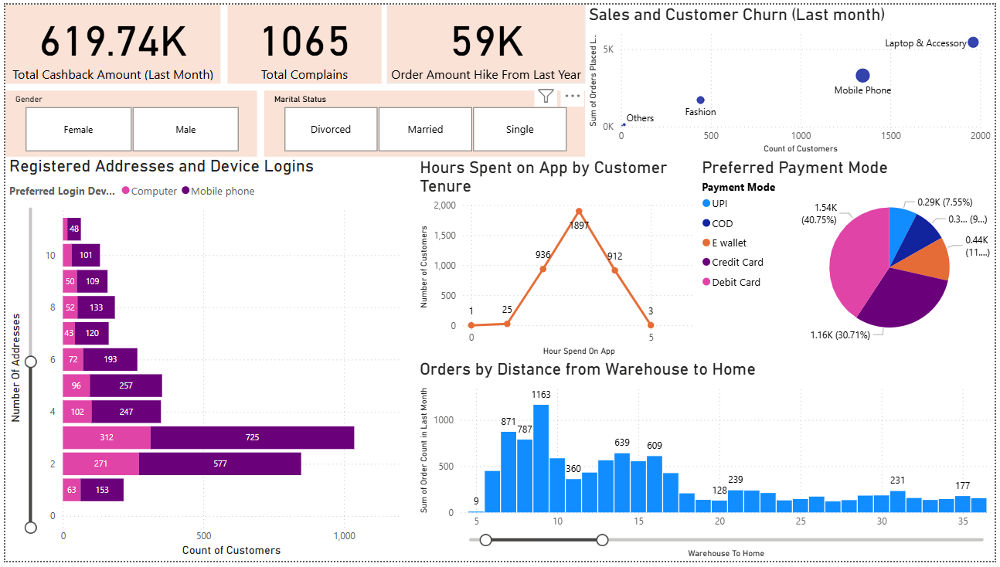

# 📉 Shop Sphere Customer Churn Analysis


> A comprehensive business intelligence report on customer churn for **Shop Sphere**, powered by **Power BI** and **DAX**. The report analyzes behavioral, transactional, and demographic data to uncover factors influencing churn, purchase behavior, and customer engagement.

---

## 📌 Project Highlights

- 📊 **Power BI dashboard** visualizing churn trends, tenure segmentation, and order behavior
- 🧠 **DAX-powered segmentation** based on tenure and warehouse-home distance
- 📍 **Customer location & behavior analytics** to determine engagement patterns
- 📱 **Multi-device usage insights** to assess customer tech adoption
- 💬 **Complaint and satisfaction metrics** to evaluate experience
- 💳 **Payment preference analysis** across active and churned customers

---

## 🧪 Technologies Used

| Tool         | Purpose                                 |
|--------------|-----------------------------------------|
| Power BI 📊   | Interactive dashboard and analytics      |
| DAX 🧮        | Custom measures and segmentation logic   |
| Excel/CSV 📂 | Dataset source (customer metrics)         |

---

## 📂 Dataset Description

The dataset contains 20+ customer-specific attributes:

- `Customer ID`  
- `Churn Status` (1 = Churned, 0 = Active)  
- `Tenure`  
- `Preferred Login Device`  
- `City Tier`  
- `Warehouse to Home Distance`  
- `Preferred Payment Mode`  
- `Gender`, `Marital Status`  
- `Hours Spent on App`  
- `Number of Devices Registered`  
- `Preferred Order Category (Last Month)`  
- `Satisfaction Score`  
- `Number of Addresses`  
- `Complaints in Last Month`  
- `Order Amount Hike from Last Year`  
- `Coupons Used in Last Month`  
- `Order Count in Last Month`  
- `Days Since Last Order`  
- `Cashback Amount Received (Last Month)`

---

## 🧾 DAX Functions for Key Analytical Segmentation

### 🥇 Customer Tenure Classification

Customers are grouped into **Bronze**, **Silver**, or **Gold** based on their relationship duration:

```DAX
Minimum Tenure Customer = MIN('E Comm'[Tenure])
Median Tenure Customer = MEDIAN('E Comm'[Tenure])
Maximum Tenure Customer = MAX('E Comm'[Tenure])

Tenure Customer Range = 
IF('E Comm'[Minimum Tenure Customer] <= 10, "Bronze",
   IF('E Comm'[Median Tenure Customer] <= 20, "Silver","Gold"))
```

---

## 🚚 Warehouse-to-Home Distance Impact

Customers are segmented by proximity to warehouse:

```DAX
Minimum distance from warehouse to home = MIN('E Comm'[Warehouse To Home])
Median Warehouse to Home = MEDIAN('E Comm'[Warehouse To Home])
Maximum distance from warehouse to home = MAX('E Comm'[Warehouse To Home])

Customer to warehouse Distance = 
IF('E Comm'[Minimum distance from warehouse to home] <= 20, "Near",
   IF('E Comm'[Median Distance from Warehouse to Home] <= 30, "Medium","Far"))
```
📦 Determines if distance affects order volume and churn.

---
## 📱 Device Usage Insights

Understanding device engagement:

```DAX
Average number of devices registered = AVERAGE('E Comm'[Number Of Device Registered])
```
🧠 Shows multi-device behavior patterns among loyal and churned customers.

---

## 📊 Insight Charts Overview: Visualizing Key Business Metrics

| 📈 Plot Title                         | 📊 Chart Type | 🧾 Columns Used                         | 🔍 Purpose                                              |
| ------------------------------------- | ------------- | --------------------------------------- | ------------------------------------------------------- |
| Churn by Tenure Segment               | Clustered Bar | Churn Status, Tenure Group              | Evaluate churn rates across Bronze/Silver/Gold segments |
| Orders vs. Warehouse Distance         | Column Chart  | Order Count, Warehouse to Home Distance | Assess distance influence on ordering behavior          |
| Preferred Payment Mode Distribution   | Pie Chart     | Payment Mode, Count                     | Identify customer payment habits                        |
| Customer Satisfaction vs. Complaints  | Scatter Plot  | Satisfaction Score, Complaints          | Spot trends in experience and dissatisfaction           |
| Cashback Distribution                 | Bar Chart     | Cashback Amount, Churn Status           | Compare incentive impact on churn                       |
| Device Engagement by Status           | Column Chart  | Number of Devices, Churn Status         | Multi-device adoption among active vs churned users     |
| Order Categories Last Month           | Donut Chart   | Order Category, Count                   | Determine trending product categories                   |
| Active Users - Hours on App by Tenure | Line Chart    | Hours Spent, Tenure Group               | Analyze session time by loyalty segment                 |

---

## 📸 Sample Visualizations

<table>
  <tr>
    <td></td>
  </tr>
  <tr>
    <td align="center">Shop Sphere Customer Churn Overview</td>
  </tr>
</table>

📊 These insights help Shop Sphere understand what drives churn and how to enhance customer engagement.

---

## 📈 Key Findings

* 💰 Total Cashback Issued (Last Month): $619.74K
* ⚠️ Total Complaints Registered: 1,065
* 🧾 Preferred Payment Mode:
  * UPI: 7.55%
  * COD: 9%
  * Cards & Wallets: ~40.75%
* 📉 Churn Drivers:
  * High churn among Bronze (short-tenure) customers
  * Customers closer to warehouses order more often
  * Device usage and session time correlate with retention
* 🛍️ Popular Order Categories:
  * Fashion 👗
  * Laptops & Accessories 💻

---

## 🧭 File Structure

```bash
shop-sphere-churn-analysis/
├── PowerBI/
│   └── ShopSphere_Churn_Report.pbix   # Power BI dashboard
├── DAX_Measures/
│   └── churn_dax_metrics.txt          # DAX functions for metrics
├── Assets/
│   └── *.png                          # Dashboard visualizations
└── README.md                          # Project documentation
```

---

## 🚀 Getting Started
1. **Clone the Repository**
```bash
git clone https://github.com/your-username/shop-sphere-churn-analysis.git
cd shop-sphere-churn-analysis
```
2. **Open Power BI Report**

 * Open ShopSphere_Churn_Report.pbix in Power BI Desktop.

3. **Explore Interactive Dashboards**

 * Navigate by tabs: Churn Overview, Customer Behavior, Payments & Complaints, Loyalty Segmentation

---

## 📜 License
This project is licensed under the MIT License.
Free to use, modify, and distribute with proper attribution.

---

## 🙌 Acknowledgments
Special thanks to:
🛍️ Shop Sphere Team for the dataset
🧠 Power BI & DAX for enabling data-driven decision-making
🌍 Open-source data community for BI inspiration and tools

---

## 📫 Contact

For feedback, ideas, or collaboration: 📧 r.manisharathod6@gmail.com
